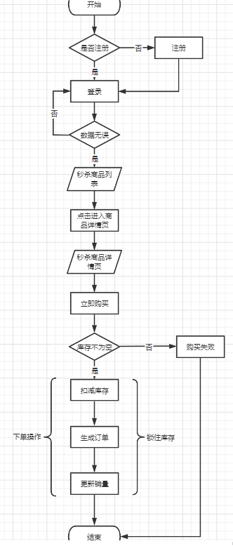

# mini-seckill

#### 介绍
mini-seckill项目是一个商品秒杀的单体应用，项目使用了SpringBoot、MyBatis、Redis、RocketMQ、Nginx、guava、fastjson、tokenbucket等框架、中间件、组件

#### 软件架构
1.第一版

2.第二版：加入Redis、guava缓存

3.第三版：加入RocketMQ对扣减库存和下单进行异步解耦

4.第四版：加入TokenBucket对用户请求进行削峰限流

#### 安装教程

1.  xxxx
2.  xxxx
3.  xxxx

#### 使用说明

1.  xxxx
2.  xxxx
3.  xxxx

#### 参与贡献

1.  Fork 本仓库
2.  新建 Feat_xxx 分支
3.  提交代码
4.  新建 Pull Request
